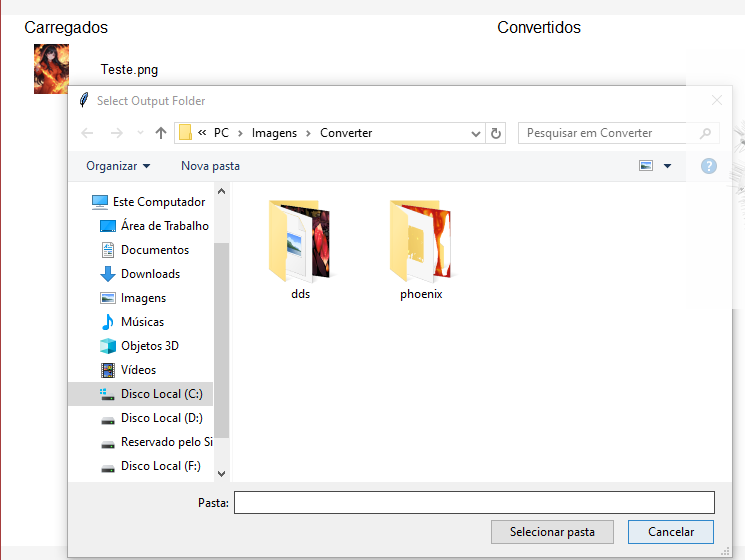

# Documentação do Código: Universal Conversor

Este documento descreve o funcionamento do "Universal Conversor", uma aplicação para conversão de imagens com interface gráfica baseada na biblioteca `tkinter`.

---

## Sumário

1. [Objetivo](#objetivo)
2. [Requisitos](#requisitos)
3. [Arquitetura do Código](#arquitetura-do-código)
4. [Principais Funcionalidades](#principais-funcionalidades)
5. [Como Utilizar](#como-utilizar)
6. [Notas sobre Implementação](#notas-sobre-implementação)
7. [Possíveis Melhorias](#possíveis-melhorias)

---

## Objetivo

O Universal Conversor tem como objetivo:
- Carregar um conjunto de imagens.
- Converter essas imagens para formatos escolhidos pelo usuário.
- Exibir uma lista de arquivos carregados e convertidos na interface gráfica.

---

## Requisitos

### Dependências

- Python 3.x
- Bibliotecas:
  - `tkinter`: Para a interface gráfica.
  - `Pillow`: Para manipulação de imagens.
  - `os`: Para manipulação de arquivos e diretórios.

### Instalação

```bash
pip install pillow
```

---

## Arquitetura do Código

O código está organizado em uma estrutura linear e conta com:

1. **Funções de Operação**: Manipulam imagens e interagem com o usuário.
2. **Interface Gráfica**: Elementos de layout e widgets para a interação.

### Estrutura Geral

- **Funções**:
  - `open_images`: Carrega imagens selecionadas pelo usuário.
  - `draw_loaded_item`: Renderiza itens carregados na interface.
  - `convert_images`: Converte imagens para o formato escolhido.
  - `draw_converted_item`: Renderiza itens convertidos na interface.
  - `choose_output_folder`: Permite ao usuário escolher a pasta de saída.
  - `show_history`: Placeholder para futura funcionalidade de histórico.
  - `exit_app`: Encerra a aplicação.

- **Interface**:
  - `Tk` configura a janela principal.
  - Widgets como `Button`, `Label`, `Canvas`, `Frame` e `ttk.Combobox`.

---

## Principais Funcionalidades

### 1. Carregar Imagens

- **Descrição**:
  Seleciona até 20 imagens do sistema de arquivos.

- **Código Relevante**:
  ```python
  filetypes = [
      ("All Image Files", "*.jpg *.jpeg *.png *.gif *.bmp *.webp *.tiff *.ico *.heic *.jfif *.svg *.dds")
  ]
  img_paths = filedialog.askopenfilenames(title="Open Images", filetypes=filetypes)
  ```

- **Resultado**: Imagens são exibidas no lado esquerdo da interface.

### 2. Converter Imagens

- **Descrição**:
  Converte imagens carregadas para o formato escolhido pelo usuário e salva em um diretório especificado.

- **Código Relevante**:
  ```python
  file_extension = output_format_var.get()
  save_path = f"{save_directory}/{file_name}_converted{file_extension}"
  img.save(save_path)
  ```

- **Resultado**: Imagens convertidas são listadas no lado direito da interface.

### 3. Escolher Formato de Saída

- **Descrição**:
  O usuário seleciona o formato de saída usando um `ttk.Combobox`.

- **Opções Disponíveis**:
  - `.jpg`, `.png`, `.gif`, `.bmp`, `.webp`, `.tiff`, `.ico`, `.heic`, `.jfif`, `.svg`, `.dds` 

### 4. Navegação

- Botões para adicionar imagens, converter, selecionar pastas e encerrar o programa.

---

## Como Utilizar

1. **Inicie o Programa**:
   Execute o arquivo Python.

2. **Carregue Imagens**:
   Clique em **Adicionar** e selecione os arquivos.

3. **Escolha o Formato de Saída**:
   Use o menu suspenso no centro da tela.

4. **Converta as Imagens**:
   Clique em **Converter** e selecione o diretório de saída.

5. **Visualize os Resultados**:
   Imagens convertidas serão exibidas no lado direito.

---


## Notas sobre Implementação

- **Limite de Imagens**:
  - Por padrão, o sistema carrega até 20 imagens.

- **Interface Responsiva**:
  - A interface não ajusta automaticamente os elementos com o redimensionamento da janela.

- **Placeholder**:
  - O recurso de histórico ainda não foi implementado.

---

## Possíveis Melhorias

1. **Histórico de Conversões**:
   - Implementar uma funcionalidade para armazenar e exibir registros de imagens convertidas.

2. **Suporte a Redimensionamento**:
   - Tornar a interface responsiva ao redimensionar a janela.

3. **Visualização de Thumbnails**:
   - Exibir uma pré-visualização maior das imagens selecionadas.

4. **Melhorar Tratamento de Erros**:
   - Adicionar mensagens de erro mais descritivas e feedback ao usuário.

5. **Suporte a Outras Extensões**:
   - Expandir a lista de formatos de entrada e saída.

---

